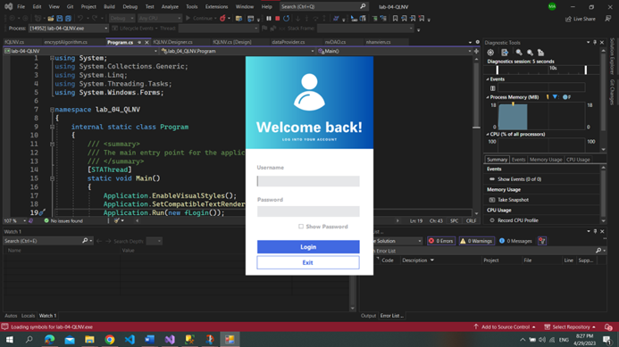
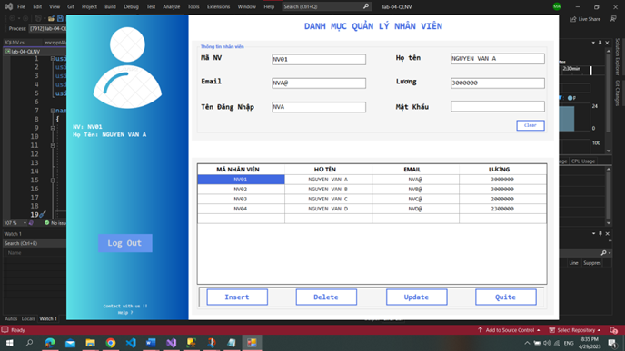
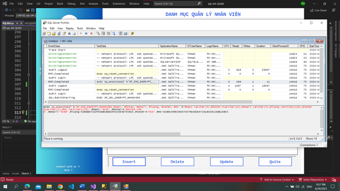

# 🔒 Applicaiton Manage Security
Use .NET framework to build app and apply  encryption on client before transiting data to store server 

- `AES_256`: encrypt salary

- `SHA-1`, `MD5`: hash password user

The functions of the app include: insert, update, delete data, login user.

## 🔥 Login screen

## 🔥 Main screen

## ✍️ Encrypt data before

## 🤓 STORED PROCEDURE

Support encryption data on server

- `SP_INS_ENCRYPT_NHANVIEN `: insert data to server
- `SP_CHECK_TAIKHOAN`: check user account

